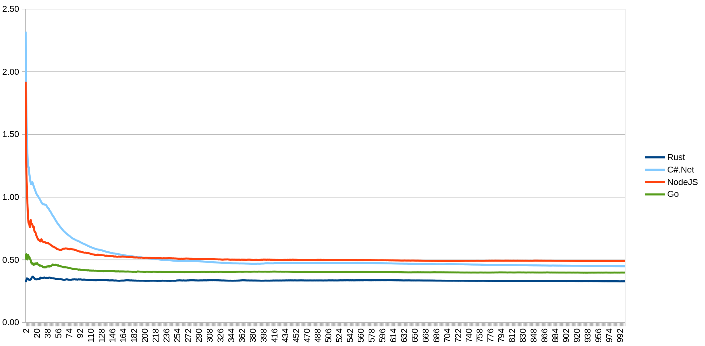

## Introduction

This repository compares implementations of a simple REST API server written in:

- NodeJS
- Rust
- Python
- Go
- Java
- C#.Net

> Initially, I was benchmarking only the three platforms mentioned above, but huge thanks to [@encbladexp](https://github.com/encbladexp) for adding measurements for GoLang as well. I won’t attempt to compare the Go implementation in terms of readability, extensibility, or maintainability - since I didn’t write it myself - but it’s clear that Go’s tooling is on par with Rust and Node.js.
> Also, big thanks to [@Avdiji](https://github.com/Avdiji) for his Java contribution. It’s a great opportunity not just to compare performance - which isn’t the only goal of this repo - but also to dive into the code and get a feel for each language and its ecosystem.

Thanks to the fact that all three server implementations follow the same REST API specification, data formats, and structure, we can compare not only their performance, but also the "look and feel" of the code in terms of:

- clarity and readability without relying on comments or documentation
- ease of maintenance
- predictability

Each implementation was built using the most stable, efficient, and widely adopted framework available:

- Rust – `actix-web`
- NodeJS – `express`
- Python – `fastapi` (with `uvicorn` as the server)
- Java - `spring-boot` (with `embedded Tomcat`)

## Test Description

Each server implementation is run in its own dedicated Docker container. Then, using proptest (in Rust), a workload is generated: N requests to the server are sent, repeated M times. For example, if one iteration consists of 100 requests (`N = 100`), and the total number of iterations is 1000 (`M = 1000`), the server handles 100,000 requests in a single test run.

For each operation type (`create`, `read`, `update`, `list`, `delete`), the response time is measured. The results are averaged and presented in a summary table:

```
| Operation       |      Count |   Total (ns) |   Avg (ns) |   Total (ms) |   Avg (ms)
| ------------------------------------------------------------------------------------
| CreatePost      |     100000 |   8489759315 |      84897 |      8489.76 |       0.08
| GetPost         |     100000 |   4776538458 |      47765 |      4776.54 |       0.05
| UpdatePost      |     100000 |   4917119584 |      49171 |      4917.12 |       0.05
| ListPost        |       1000 |    109879545 |     109879 |       109.88 |       0.11
| DeletePost      |     100000 |   3734050887 |      37340 |      3734.05 |       0.04
```

In addition, every individual measurement is stored in a CSV file, which allows for tracking performance dynamics over time and identifying warm-up phases, latency spikes, and stabilization plateaus.

It is important to note that during testing, the server performs no disk or external network operations  everything runs purely in memory. As a result, the measurements reflect the raw performance of the server’s communication stack: parsing, routing, serialization, and back.

## Performance


The clear leaders in performance are C#.Net, Go, Rust, and Node.js. We also observe two notable outliers - Java and Python, both showing significantly higher response times.

To determine which of the top four is truly the fastest, let’s take a closer look at the performance chart below:



Unsurprisingly, Rust is the clear winner, consistently averaging around 0.4 ms per request. Right behind it are C#.Net and Node.js, which appear almost indistinguishable at first glance. However, upon closer inspection, it’s fair to say that Node.js does fall slightly behind. Go also delivers solid performance, holding its position in the top four with stable and competitive response times.

Just to clarify - the Y-axis represents the number of test iterations. As mentioned earlier, each iteration sends 100 requests. So if you see 100 on the Y-axis, that means a total of 10,000 requests (100 × 100) were sent.

This makes one thing obvious: if you're paying for every millisecond and consumed resource (as is the case with platforms like AWS Lambda), the choice becomes trivial  avoid Python.

However, what’s even more interesting is the behavior during the first 5,000 to 10,000 requests. Node.js and Python clearly exhibit a warm-up phase before stabilizing, which aligns with expectations: Rust delivers compiled machine code immediately, while Python interprets and incrementally builds internal structures at runtime. Node.js, powered by the V8 engine, employs JIT compilation and progressively optimizes hot paths during execution.

C#.Net, although also JIT-based, demonstrates a much shorter and less volatile warm-up period compared to Node.js. Its performance stabilizes quickly and remains consistent thereafter - likely due to a combination of ahead-of-time compilation features (like ReadyToRun images) and an efficient runtime that mitigates early-phase jitter.

Java, on the other hand, behaves more like an outlier. While it does eventually reach a steady state, the time it takes is significantly longer than any other runtime in this comparison - even Python. For thousands of requests, latency remains elevated, suggesting either a slower optimization pipeline or more aggressive background activity (e.g., class loading, GC tuning, or tiered compilation delays). This prolonged warm-up phase seriously limits Java’s suitability for burst-driven or serverless architectures, where predictable early responsiveness is critical.

What remains unclear for JIT-based runtimes is how stable their optimized states actually are. In the case of V8, it's well-documented that the engine may discard or recompile optimizations due to deoptimization or garbage collection, potentially causing unpredictable latency spikes. Python doesn’t use JIT but still exhibits lazy re-initialization of internal components under certain conditions. These behaviors raise a broader concern: can we truly rely on the notion of a “warmed-up” server, especially in environments where instances may be frequently restarted or scaled dynamically?

As mentioned earlier, these implementations do not perform any IO operations, meaning that in a real-world scenario we should expect even greater differences. And here, one thing seems fairly certain: Python is unlikely to close the relative performance gap under more realistic conditions.

## Reliability, Maintainability, and Clarity

While the numbers speak for themselves, I’d also like to share a subjective opinion regarding the quality and readability of the code. And yes  this opinion is inherently biased, and I’d like to apologize in advance to Python developers. Nothing personal  just personal impressions :)

### Node.js and Rust

The Node.js and Rust implementations are noticeably easier to read. Sure, part of that is due to the similarity in syntax, but more importantly, both solutions offer clear structure and modularity. The architectural patterns are immediately recognizable: here's the model, here's the schema, here's the server  and it's instantly clear how to extend, where to write tests, and where to plug in middleware. Everything looks cohesive and scalable.

### Python

The Python version, despite its conciseness, feels more like a single large script than a full-fledged application. Yes, technically it is a script  but it starts a server, and you'd expect something with more structure: boundaries, layers, and modules. FastAPI certainly allows for clean and modular design, but it doesn’t enforce it out of the box, making it easy to fall into a flat, monolithic layout.

It’s important to clarify: I rarely write Python, and it's entirely possible that I simply wrote a poor implementation. A more experienced Python developer would likely write something much cleaner and better organized. Which is exactly why I emphasize  this is just a personal impression, not an objective truth.

### Java

The Java implementation was kindly contributed by [@Avdiji](https://github.com/Avdiji). I won't attempt to evaluate its correctness - I’m simply not in a position to do so, as I’m not the author. However, I can share some personal impressions.

Java is clearly geared toward enterprise-scale development, and that’s immediately reflected in the structure of the code. It naturally falls into clean, predictable patterns - which is exactly what enterprise environments value most: predictability and long-term maintainability. That said, the need to explicitly manage numerous dependencies and the surrounding runtime environment makes the solution feel heavier and more complex - especially when compared to C#.Net.

Once again, sincere thanks to [@Avdiji](https://github.com/Avdiji) for contributing to this comparison.

### C#.Net

I hadn’t touched C# or .NET for over seven years, and I was genuinely surprised by its performance here. The results are impressive - and denying that would be foolish. The fact that both C#.Net and Node.js deliver similar average latencies is not particularly surprising, since both rely on JIT compilation.

What did surprise me, though - and quite strongly - was how clean and straightforward the C# solution turned out to be, especially in contrast to Java. At the same time, it still carries that unmistakable “enterprise feel,” with a strong emphasis on OOP and structure. Looking at the code, it becomes abundantly clear why serious corporations often default to the .NET stack and rarely consider alternatives. It’s predictable, disciplined, and reliable.

But then again... we all know what Microsoft really makes its money on 😉

### Rust vs Node.js

Comparing Rust and Node.js directly:

In Node.js, it’s easier and faster to get a working solution  but it’s also easier to miss something. For example, you might forget to add an uncaughtException handler or overlook a failure in a promise chain, and it could come back to bite you in production.

Rust, on the other hand, demands more effort up front. But in return, it forces you to think about the edges  about errors, types, and potential failure points. It slows down the initial development, but results in a system that’s far more reliable and resilient.

### Go

The Go implementation clearly delivers competitive performance. Moreover, it outperforms Node.js in part because - like Rust - it doesn't require any "warm-up" period and reaches a stable performance plateau almost immediately.

As for readability, extensibility, and maintainability - I won’t evaluate the Go solution, since it wasn’t written by me. Once again, big thanks to [@encbladexp](https://github.com/encbladexp) for contributing the Go server implementation.

## Subjective Conclusions

The conclusion is simple: don’t put Python into production if performance matters to you. It’s great for scripts, prototypes, and lightweight APIs, but under high load, its latency becomes increasingly noticeable.

As for Java... it leaves a strange impression. It feels like Java has fallen behind and now mostly lives in the legacy space - not as a deliberate choice, but rather because moving away from it often costs more than just accepting its trade-offs. In modern scenarios, Java rarely feels like the optimal starting point.

The position of C#.Net is more clear-cut: this is enterprise territory. The good news is that compared to what I saw nearly a decade ago, it has come a long way. Things are cleaner, easier, and the performance is absolutely competitive. I was also pleasantly surprised by how smooth the experience was running it in Docker on Linux - something that, back in the early days of .NET, used to be a real headache. I don’t remember the exact technical reasons, but I vividly remember the pain ;)

Node.js performs well. It’s competitive in terms of speed and especially appealing when rapid development is a priority. However, in terms of long-term maintainability and reliability, it demands strict discipline: you need to handle exceptions meticulously, guard against edge cases, and be ready for unexpected behavior stemming from its asynchronous nature and garbage collection.

Rust is at the opposite end of the spectrum. Getting started takes longer - you'll invest more time in architecture, types, and design decisions. But the payoff is a system that’s incredibly predictable and reliable, where simply “forgetting to handle an error” is nearly impossible.

Choosing between Node.js, Rust, and Go isn’t trivial. It depends on your priorities - development velocity versus long-term reliability, fast iteration versus operational safety. But one thing is clear: all three are significantly better suited than Python or Java in scenarios where performance and stability truly matter. Personally, I see all three - Node.js, Rust, and Go - as ideal foundations for modern startups. That said, “scaling up” with Node.js can become problematic without clearly articulated internal standards. JavaScript and TypeScript offer a lot of freedom, which inevitably requires strong constraints and team-wide discipline.

C#, on the other hand, feels like the natural choice for large, structured organizations. It’s designed for scale, and it shows.

## Running the Tests

Each implementation contains a run_test.sh script. This script starts a Docker Compose setup which:

- launches the server
- runs the test (in all cases, the Rust-based test is used to generate load via `proptest`)
