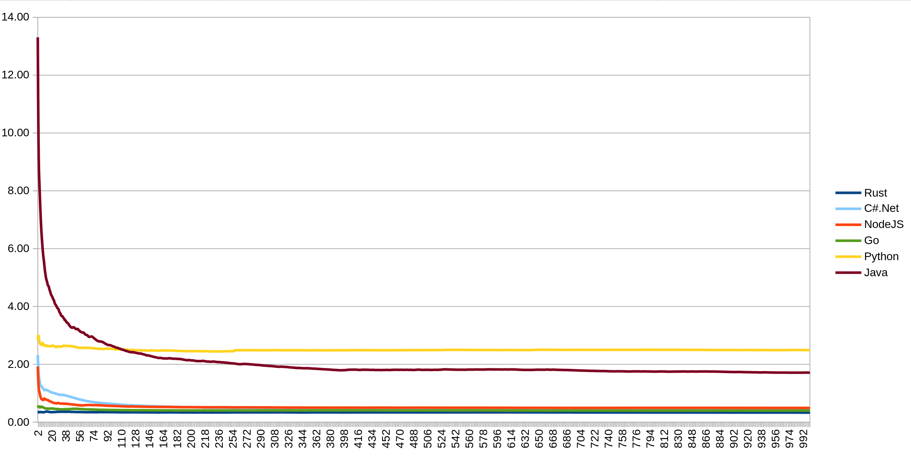

## Introduction

This repository compares implementations of a simple REST API server written in:

- NodeJS
- Rust
- Python
- Go
- Java

> Initially, I was benchmarking only the three platforms mentioned above, but huge thanks to [@encbladexp](https://github.com/encbladexp) for adding measurements for GoLang as well. I won’t attempt to compare the Go implementation in terms of readability, extensibility, or maintainability - since I didn’t write it myself - but it’s clear that Go’s tooling is on par with Rust and Node.js.

Thanks to the fact that all three server implementations follow the same REST API specification, data formats, and structure, we can compare not only their performance, but also the "look and feel" of the code in terms of:

- clarity and readability without relying on comments or documentation
- ease of maintenance
- predictability

Each implementation was built using the most stable, efficient, and widely adopted framework available:

- Rust – `actix-web`
- NodeJS – `express`
- Python – `fastapi` (with `uvicorn` as the server)
- Java - `spring-boot` (with `embedded Tomcat`)

## Test Description

Each server implementation is run in its own dedicated Docker container. Then, using proptest (in Rust), a workload is generated: N requests to the server are sent, repeated M times. For example, if one iteration consists of 100 requests (`N = 100`), and the total number of iterations is 1000 (`M = 1000`), the server handles 100,000 requests in a single test run.

For each operation type (`create`, `read`, `update`, `list`, `delete`), the response time is measured. The results are averaged and presented in a summary table:

```
| Operation       |      Count |   Total (ns) |   Avg (ns) |   Total (ms) |   Avg (ms)
| ------------------------------------------------------------------------------------
| CreatePost      |     100000 |   8489759315 |      84897 |      8489.76 |       0.08
| GetPost         |     100000 |   4776538458 |      47765 |      4776.54 |       0.05
| UpdatePost      |     100000 |   4917119584 |      49171 |      4917.12 |       0.05
| ListPost        |       1000 |    109879545 |     109879 |       109.88 |       0.11
| DeletePost      |     100000 |   3734050887 |      37340 |      3734.05 |       0.04
```

In addition, every individual measurement is stored in a CSV file, which allows for tracking performance dynamics over time and identifying warm-up phases, latency spikes, and stabilization plateaus.

It is important to note that during testing, the server performs no disk or external network operations  everything runs purely in memory. As a result, the measurements reflect the raw performance of the server’s communication stack: parsing, routing, serialization, and back.

## Performance



The clear leader in terms of performance is the Rust implementation, with an average request time consistently around 0.4 ms. Next comes Node.js, delivering about 0.5 ms per request, while Python noticeably lags behind with an average of approximately 2.5 ms per request.

Just to clarify - the Y-axis represents the number of test iterations. As mentioned earlier, each iteration sends 100 requests. So if you see 100 on the Y-axis, that means a total of 10,000 requests (100 × 100) were sent.

This makes one thing obvious: if you're paying for every millisecond and consumed resource (as is the case with platforms like AWS Lambda), the choice becomes trivial  avoid Python.

However, what’s even more interesting is the behavior during the first 5,000 to 10,000 requests. Both Node.js and Python exhibit a clear warm-up period before reaching a stable performance level. This is understandable: Rust delivers compiled machine code from the start, while Python interprets the code and caches structures on the fly. Node.js, running on V8, applies JIT compilation, gradually optimizing hot paths during execution.

What remains unclear is how stable these optimized states actually are. In the case of V8, it’s known that JIT may occasionally drop or recompile optimizations (e.g., during deoptimization or garbage collection), potentially causing localized latency spikes. Python doesn't use JIT, but it also features lazy initialization of certain components, which might be repeated under specific conditions. This raises a legitimate question: can we really rely on a “warmed-up” server state, especially in short-lived environments like serverless?

As mentioned earlier, these implementations do not perform any IO operations, meaning that in a real-world scenario we should expect even greater differences. And here, one thing seems fairly certain: Python is unlikely to close the relative performance gap under more realistic conditions.

## Reliability, Maintainability, and Clarity

While the numbers speak for themselves, I’d also like to share a subjective opinion regarding the quality and readability of the code. And yes  this opinion is inherently biased, and I’d like to apologize in advance to Python developers. Nothing personal  just personal impressions :)

### Node.js and Rust

The Node.js and Rust implementations are noticeably easier to read. Sure, part of that is due to the similarity in syntax, but more importantly, both solutions offer clear structure and modularity. The architectural patterns are immediately recognizable: here's the model, here's the schema, here's the server  and it's instantly clear how to extend, where to write tests, and where to plug in middleware. Everything looks cohesive and scalable.

### Python

The Python version, despite its conciseness, feels more like a single large script than a full-fledged application. Yes, technically it is a script  but it starts a server, and you'd expect something with more structure: boundaries, layers, and modules. FastAPI certainly allows for clean and modular design, but it doesn’t enforce it out of the box, making it easy to fall into a flat, monolithic layout.

It’s important to clarify: I rarely write Python, and it's entirely possible that I simply wrote a poor implementation. A more experienced Python developer would likely write something much cleaner and better organized. Which is exactly why I emphasize  this is just a personal impression, not an objective truth.

### Rust vs Node.js

Comparing Rust and Node.js directly:

In Node.js, it’s easier and faster to get a working solution  but it’s also easier to miss something. For example, you might forget to add an uncaughtException handler or overlook a failure in a promise chain, and it could come back to bite you in production.

Rust, on the other hand, demands more effort up front. But in return, it forces you to think about the edges  about errors, types, and potential failure points. It slows down the initial development, but results in a system that’s far more reliable and resilient.

### Go

The Go implementation clearly delivers competitive performance. Moreover, it outperforms Node.js in part because - like Rust - it doesn't require any "warm-up" period and reaches a stable performance plateau almost immediately.

As for readability, extensibility, and maintainability - I won’t evaluate the Go solution, since it wasn’t written by me. Once again, big thanks to [@encbladexp](https://github.com/encbladexp) for contributing the Go server implementation.

## Subjective Conclusions

The conclusion is simple: don’t put Python into production if performance matters to you. It’s great for scripts, prototypes, and lightweight APIs  but under high load, its latency becomes quite noticeable.

Node.js performs well  it’s competitive in terms of speed and especially appealing when fast development time is a priority. However, from a maintenance and reliability perspective, it requires strict discipline: you need to handle exceptions carefully, account for edge cases, and be prepared for surprises caused by asynchrony and garbage collection.

Rust is the opposite end of the spectrum. Getting started is harder: you’ll spend more time on architecture, types, and design. But in return, you get a system that is as predictable and reliable as it gets, where simply “forgetting to handle an error” is nearly impossible.

Choosing between Node.js, Rust and Go is not so obvious. It depends on your priorities: development speed vs. long-term reliability, short-term efficiency vs. long-term operational safety. But one thing is clear: both are significantly more suitable than Python in scenarios where performance and stability are critical.

## Running the Tests

Each implementation contains a run_test.sh script. This script starts a Docker Compose setup which:

- launches the server
- runs the test (in all cases, the Rust-based test is used to generate load via `proptest`)
